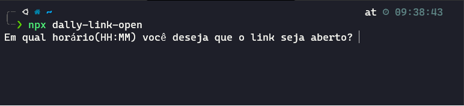
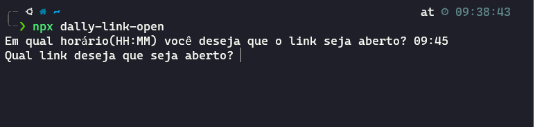
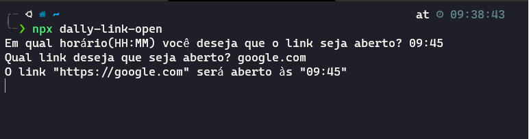
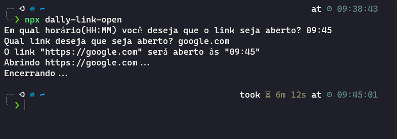
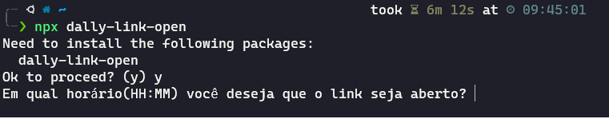

### Aplicação feita com intuito de programar abertura de link em determinado horário

Para instalar execute:
~~~
npm i dally-link-open
~~~

Caso queira executar o modulo sem instalar as dependencias execute:
~~~
npx dally-link-open
~~~
---
## A dinâmica de funcionamento deverá ser essa:

### * O `npx dally-link-open` é executado;

### * É necessário que se coloque o horário no formato `HH:MM` como no exemplo abaixo;

### * Agora na próxima etapa é solicitado o link que deseja ser executado;

### * Agora é só aguardar e quando chegar o horário o link será aberto :smirk:;

#
### `ATENÇÃO!!!` Caso ocorra a mensagem abaixo é só dar o `y` e ser feliz :smile:.

